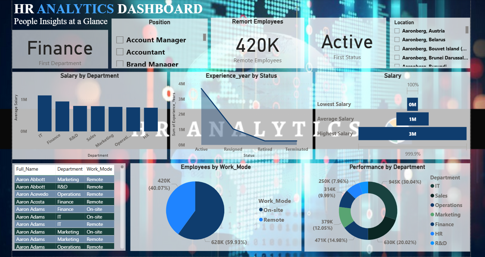

# 📊 HR Analytics Dashboard

An end-to-end **HR Analytics** project built using **Excel, Python, and Power BI**. This project analyzes employee data to provide insights into workforce distribution, salaries, work modes, performance, and employee status through an interactive dashboard.

---

## 📌 Project Overview

The goal of this project is to transform raw HR data into meaningful business insights by following the complete data analytics process:

- Data Collection
- Data Cleaning
- Data Analysis
- Data Visualization
- Business Insights

---

## 🎯 Objectives

- Analyze employee data across departments.
- Monitor salary distribution.
- Evaluate employee performance.
- Analyze work mode preferences.
- Track employee status.
- Create an interactive dashboard for HR decision-making.

---

## 🛠️ Tools & Technologies

- 📗 Microsoft Excel
- 🐍 Python
- 📊 Power BI
- 📑 CSV Dataset

---

## 📂 Project Workflow

Raw Dataset
↓
Excel (Data Validation & Formatting)
↓
Python (Data Cleaning & EDA)
↓
Power BI (Dashboard & DAX)
↓
Business Insights

---

## 🧹 Data Cleaning (Python)

The following preprocessing steps were performed:

- Removed duplicate records
- Checked missing values
- Trimmed unwanted spaces
- Converted data types
- Standardized column names
- Performed Exploratory Data Analysis (EDA)
- Exported cleaned dataset

---

## 📊 Dashboard Features

### KPI Cards

- Total Employees
- Active Employees
- Remote Employees
- Average Salary
- Highest Salary
- Lowest Salary

### Charts

- Salary by Department
- Employees by Work Mode
- Performance by Department
- Experience by Status
- Employee Details Table

### Filters

- Department
- Position
- Location

---

## 📈 Key Insights

- Department-wise salary comparison
- Employee work mode distribution
- Active workforce monitoring
- Experience analysis
- Performance comparison
- Department and location filtering

---

## 📷 Dashboard Preview

### Overview

---

## 🚀 Future Improvements

- Employee Attrition Analysis
- Recruitment Analytics
- HR Forecasting
- Machine Learning Prediction
- Power BI Service Deployment

## Author
* Priyanka Das *
